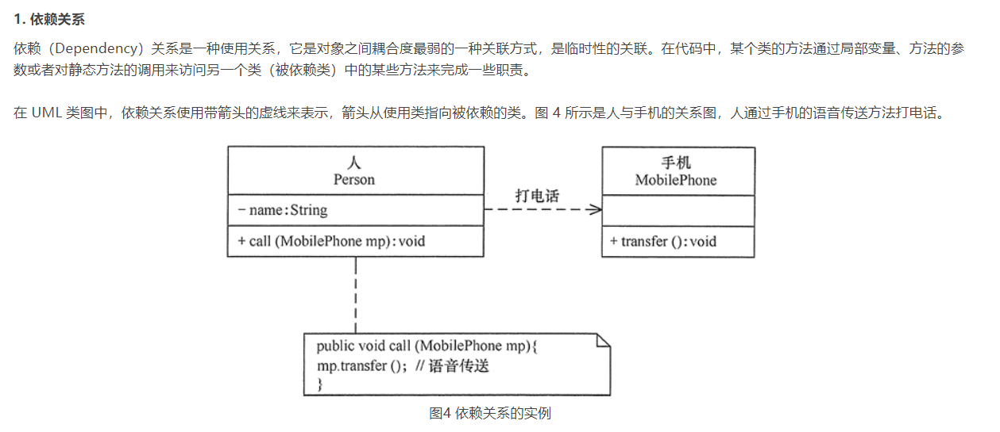
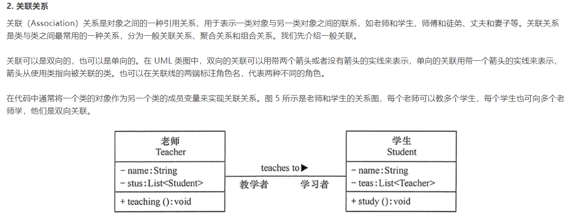
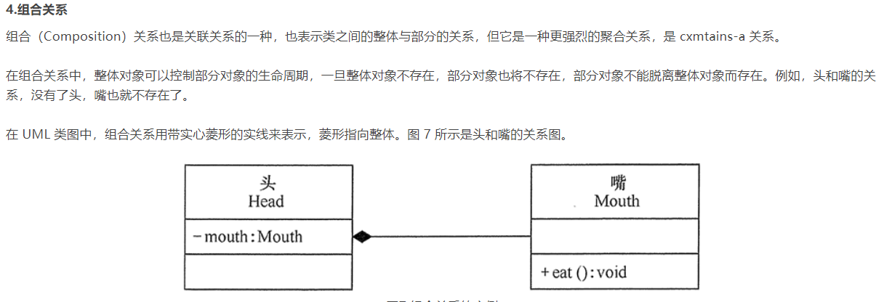
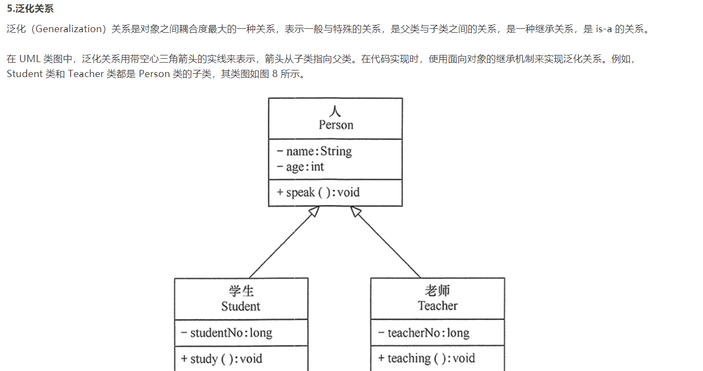
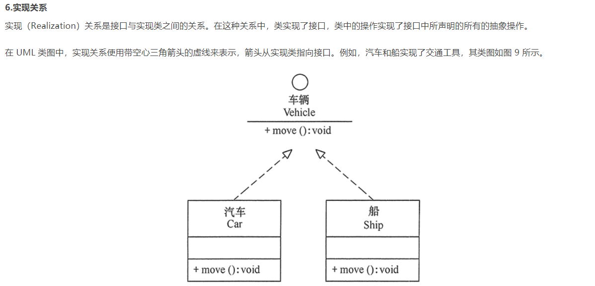

# 设计模式

1. 根据目的来分

根据模式是用来完成什么工作来划分，这种方式可分为创建型模式、结构型模式和行为型模式 3 种。
创建型模式：用于描述“怎样创建对象”，它的主要特点是“将对象的创建与使用分离”。GoF 中提供了单例、原型、工厂方法、抽象工厂、建造者等 5 种创建型模式。

结构型模式：用于描述如何将类或对象按某种布局组成更大的结构，GoF 中提供了代理、适配器、桥接、装饰、外观、享元、组合等 7 种结构型模式。

行为型模式：用于描述类或对象之间怎样相互协作共同完成单个对象都无法单独完成的任务，以及怎样分配职责。GoF 中提供了模板方法、策略、命令、职责链、状态、观察者、中介者、迭代器、访问者、备忘录、解释器等 11 种行为型模式。

2. 根据作用范围来分

根据模式是主要用于类上还是主要用于对象上来分，这种方式可分为类模式和对象模式两种。

类模式：用于处理类与子类之间的关系，这些关系通过继承来建立，是静态的，在编译时刻便确定下来了。GoF中的工厂方法、（类）适配器、模板方法、解释器属于该模式。

对象模式：用于处理对象之间的关系，这些关系可以通过组合或聚合来实现，在运行时刻是可以变化的，更具动态性。GoF 中除了以上 4 种，其他的都是对象模式。

GoF的23种设计模式的功能
    前面说明了 GoF 的 23 种设计模式的分类，现在对各个模式的功能进行介绍。
    
    单例（Singleton）模式：某个类只能生成一个实例，该类提供了一个全局访问点供外部获取该实例，其拓展是有限多例模式。
    原型（Prototype）模式：将一个对象作为原型，通过对其进行复制而克隆出多个和原型类似的新实例。
    工厂方法（Factory Method）模式：定义一个用于创建产品的接口，由子类决定生产什么产品。
    抽象工厂（AbstractFactory）模式：提供一个创建产品族的接口，其每个子类可以生产一系列相关的产品。
    建造者（Builder）模式：将一个复杂对象分解成多个相对简单的部分，然后根据不同需要分别创建它们，最后构建成该复杂对象。
    代理（Proxy）模式：为某对象提供一种代理以控制对该对象的访问。即客户端通过代理间接地访问该对象，从而限制、增强或修改该对象的一些特性。
    适配器（Adapter）模式：将一个类的接口转换成客户希望的另外一个接口，使得原本由于接口不兼容而不能一起工作的那些类能一起工作。
    桥接（Bridge）模式：将抽象与实现分离，使它们可以独立变化。它是用组合关系代替继承关系来实现，从而降低了抽象和实现这两个可变维度的耦合度。
    装饰（Decorator）模式：动态的给对象增加一些职责，即增加其额外的功能。
    外观（Facade）模式：为多个复杂的子系统提供一个一致的接口，使这些子系统更加容易被访问。
    享元（Flyweight）模式：运用共享技术来有效地支持大量细粒度对象的复用。
    组合（Composite）模式：将对象组合成树状层次结构，使用户对单个对象和组合对象具有一致的访问性。
    模板方法（TemplateMethod）模式：定义一个操作中的算法骨架，而将算法的一些步骤延迟到子类中，使得子类可以不改变该算法结构的情况下重定义该算法的某些特定步骤。
    策略（Strategy）模式：定义了一系列算法，并将每个算法封装起来，使它们可以相互替换，且算法的改变不会影响使用算法的客户。
    命令（Command）模式：将一个请求封装为一个对象，使发出请求的责任和执行请求的责任分割开。
    职责链（Chain of Responsibility）模式：把请求从链中的一个对象传到下一个对象，直到请求被响应为止。通过这种方式去除对象之间的耦合。
    状态（State）模式：允许一个对象在其内部状态发生改变时改变其行为能力。
    观察者（Observer）模式：多个对象间存在一对多关系，当一个对象发生改变时，把这种改变通知给其他多个对象，从而影响其他对象的行为。
    中介者（Mediator）模式：定义一个中介对象来简化原有对象之间的交互关系，降低系统中对象间的耦合度，使原有对象之间不必相互了解。
    迭代器（Iterator）模式：提供一种方法来顺序访问聚合对象中的一系列数据，而不暴露聚合对象的内部表示。
    访问者（Visitor）模式：在不改变集合元素的前提下，为一个集合中的每个元素提供多种访问方式，即每个元素有多个访问者对象访问。
    备忘录（Memento）模式：在不破坏封装性的前提下，获取并保存一个对象的内部状态，以便以后恢复它。
    解释器（Interpreter）模式：提供如何定义语言的文法，以及对语言句子的解释方法，即解释器。

## 类之间的关系

+ 依赖关系

+ 关联关系(多对多)

+ 聚合关系（has a）

+ 组合关系（cxmtains-a 包含）

+ 泛化关系（ is-a 集成）

+ 实现关系（继承）

# 设计原则

+ 开闭原则

    软件实体应当对扩展开放，对修改关闭
    
+ 里氏替换
    
    继承必须确保超类所拥有的性质在子类中仍然成立（不要重写父类的方法）

+ 依赖倒置

    高层模块不应该依赖低层模块，两者都应该依赖其抽象；抽象不应该依赖细节，细节应该依赖抽象

+ 单一职责

    单一职责原则规定一个类应该有且仅有一个引起它变化的原因，否则类应该被拆分
    
+ 接口隔离原则

     要为各个类建立它们需要的专用接口，而不要试图去建立一个很庞大的接口供所有依赖它的类去调用。
+ 迪米特

    如果两个软件实体无须直接通信，那么就不应当发生直接的相互调用，可以通过第三方转发该调用。

+ 合成复用原则
    
    要求在软件复用时，要尽量先使用组合或者聚合等关联关系来实现，其次才考虑使用继承关系来实现。

-----

创建型模式分为以下几种。

    单例（Singleton）模式：某个类只能生成一个实例，该类提供了一个全局访问点供外部获取该实例，其拓展是有限多例模式。
    
    原型（Prototype）模式：将一个对象作为原型，通过对其进行复制而克隆出多个和原型类似的新实例。
    
    工厂方法（FactoryMethod）模式：定义一个用于创建产品的接口，由子类决定生产什么产品。
    
    抽象工厂（AbstractFactory）模式：提供一个创建产品族的接口，其每个子类可以生产一系列相关的产品。
    
    建造者（Builder）模式：将一个复杂对象分解成多个相对简单的部分，然后根据不同需要分别创建它们，最后构建成该复杂对象。

由于组合关系或聚合关系比继承关系耦合度低，满足“合成复用原则”，所以对象结构型模式比类结构型模式具有更大的灵活性。

结构型模式分为以下 7 种：  
代理（Proxy）模式：为某对象提供一种代理以控制对该对象的访问。即客户端通过代理间接地访问该对象，从而限制、增强或修改该对象的一些特性。
动态代理就是通过 method.invoke(Object,Object[] args)
  
适配器（Adapter）模式：将一个类的接口转换成客户希望的另外一个接口，使得原本由于接口不兼容而不能一起工作的那些类能一起工作。  
  
桥接（Bridge）模式：将抽象与实现分离，使它们可以独立变化。它是用组合关系代替继承关系来实现的，从而降低了抽象和实现这两个可变维度的耦合度。  

装饰（Decorator）模式：动态地给对象增加一些职责，即增加其额外的功能。  
外观（Facade）模式：为多个复杂的子系统提供一个一致的接口，使这些子系统更加容易被访问。  
享元（Flyweight）模式：运用共享技术来有效地支持大量细粒度对象的复用。  
组合（Composite）模式：将对象组合成树状层次结构，使用户对单个对象和组合对象具有一致的访问性。  