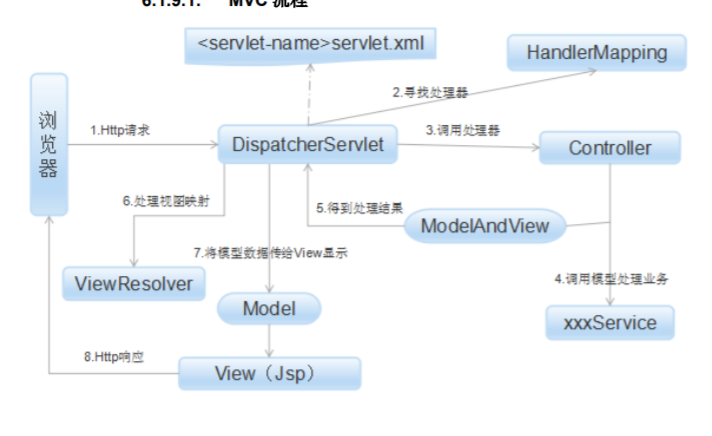

#spring 原理

它是一个全面的、企业应用开发一站式的解决方案，贯穿表现层、业务层、持久层。
但是 Spring 仍然可以和其他的框架无缝整合。 
## Spring 特性 
 
+ 轻量级 
+ 控制反转 
+ 面向切面 
+ 容器 
+ 框架集合 
## Spring 模块

Core

AOP

ORM

DAO

Web

Spring EE
## Spring Ioc原理
概念： 通过一个配置文件描述 Bean 及 Bean 之间的依赖关系，利用 Java 语言的反射功能实例化 Bean 并建立 Bean 之间的依赖关系。 Spring 的 IoC 容器在完成这些底层工作的基础上，还提供 了 Bean 实例缓存、生命周期管理、 Bean 实例代理、事件发布、资源装载等高级服务


如何注入bean：
1. 扫描XML中的 <bean>、java类中的@Configuration和@Autowired
2. 在Spring容器中生成Bean定义注册表
3. 根据注册表实例化bean
4. 将Bean放到spring容器中（bean缓存池）
5. 使用Bean


## IOC 容器实现

BeanFactory  框架基础设施

    BeanFactory 是 Spring 框架的基础设施，面向 Spring 本身；ApplicationContext 面向使用 Spring 框架的开发者，几乎所有的应用场合我们都直接使用 ApplicationContext 而非底层 的 BeanFactory。 
 
ApplicationContext 面向开发应用

    ApplicationContext 由 BeanFactory 派生而来，提供了更多面向实际应用的功能。
    ApplicationContext 继承了 HierarchicalBeanFactory 和 ListableBeanFactory 接口，在此基础 上，还通过多个其他的接口扩展了 BeanFactory 的功能

WebApplication 体系架构

     WebApplicationContext 是专门为 Web 应用准备的，它允许从相对于 Web 根目录的 路径中装载配置文件完成初始化工作。从 WebApplicationContext 中可以获得
     ServletContext 的引用，整个 Web 应用上下文对象将作为属性放置到 ServletContext 中，以便 Web 应用环境可以访问 Spring 应用上下文
     
     
## spring bean 的作用域

    分别为 singleton（单例）、
    prototype 原型模式每次使用时创
    request、一次http请求一个bean
    session 不同的实例之间不共享属性，且实例仅在自己的 session 请求
            内有效，请求结束，则实例将被销毁
    global session
    
    
## spring bean 的生命周期

   + 实例化
   + 依赖注入 、setName等
   + 执行自定义接口方法
   + 使用
   + 调用destory方法
   
   
## spring 依赖注入4种方式

 + 构造器注入
  ```
/*带参数，方便利用构造器进行注入*/
 public CatDaoImpl(String message){
 this. message = message;
 }
<bean id="CatDaoImpl" class="com.CatDaoImpl">
<constructor-arg value=" message "></constructor-arg>
</bean>
 ```
 
 + setter方法注入
 ```
 public class Id {
 private int id;
 public int getId() { return id; }
 public void setId(int id) { this.id = id; }
}
<bean id="id" class="com.id "> <property name="id" value="123"></property> </bean> 
```
  + 静态工厂注入
  ```
public class DaoFactory { //静态工厂
 public static final FactoryDao getStaticFactoryDaoImpl(){
 return new StaticFacotryDaoImpl();
 }
}
public class SpringAction {
 private FactoryDao staticFactoryDao; //注入对象
 //注入对象的 set 方法
 public void setStaticFactoryDao(FactoryDao staticFactoryDao) {
 this.staticFactoryDao = staticFactoryDao;
 }
}
//factory-method="getStaticFactoryDaoImpl"指定调用哪个工厂方法
 <bean name="springAction" class=" SpringAction" >
 <!--使用静态工厂的方法注入对象,对应下面的配置文件-->
 <property name="staticFactoryDao" ref="staticFactoryDao"></property>
 </bean>
 <!--此处获取对象的方式是从工厂类中获取静态方法-->
<bean name="staticFactoryDao" class="DaoFactory"
factory-method="getStaticFactoryDaoImpl">
</bean>
```
  + 实例工厂
    需要先在xml中new对象
 ```
public class DaoFactory { //实例工厂
 public FactoryDao getFactoryDaoImpl(){
 return new FactoryDaoImpl(); 
13/04/2018 Page 128 of 283
 }
}
public class SpringAction {
 private FactoryDao factoryDao; //注入对象
 public void setFactoryDao(FactoryDao factoryDao) {
 this.factoryDao = factoryDao;
 }
}
 <bean name="springAction" class="SpringAction">
 <!--使用实例工厂的方法注入对象,对应下面的配置文件-->
 <property name="factoryDao" ref="factoryDao"></property>
 </bean>
 <!--此处获取对象的方式是从工厂类中获取实例方法-->
<bean name="daoFactory" class="com.DaoFactory"></bean>
<bean name="factoryDao" factory-bean="daoFactory"
factory-method="getFactoryDaoImpl"></bean> 
```

## aop

AOP 核心概念
1、切面（aspect）：类是对物体特征的抽象，切面就是对横切关注点的抽象

2、横切关注点：对哪些方法进行拦截，拦截后怎么处理，这些关注点称之为横切关注点。

3、连接点（joinpoint）：被拦截到的点，因为 Spring 只支持方法类型的连接点，所以在 Spring
中连接点指的就是被拦截到的方法，实际上连接点还可以是字段或者构造器。

4、切入点（pointcut）：对连接点进行拦截的定义

5、通知（advice）：所谓通知指的就是指拦截到连接点之后要执行的代码，通知分为前置、后置、
异常、最终、环绕通知五类。

6、目标对象：代理的目标对象

7、织入（weave）：将切面应用到目标对象并导致代理对象创建的过程


8、引入（introduction）：在不修改代码的前提下，引入可以在运行期为类动态地添加一些方法
或字段

AOP 两种代理方式

Spring 提供了两种方式来生成代理对象: JDKProxy 和 Cglib，具体使用哪种方式生成由
AopProxyFactory 根据 AdvisedSupport 对象的配置来决定。默认的策略是如果目标类是接口，
则使用 JDK 动态代理技术，否则使用 Cglib 来生成代理

实现方式

```java
@Aspect
public class TransactionDemo {
 @Pointcut(value="execution(* com.yangxin.core.service.*.*.*(..))")
 public void point(){
 }
 @Before(value="point()")
 public void before(){
 System.out.println("transaction begin");
 }
 @AfterReturning(value = "point()")
 public void after(){
 System.out.println("transaction commit");
 }
 @Around("point()")
 public void around(ProceedingJoinPoint joinPoint) throws Throwable{
 System.out.println("transaction begin");
 joinPoint.proceed();
 System.out.println("transaction commit");
 }
}
```
## spring mvc

mvc流程



## SPRING BOOT 原理

1. 创建独立的 Spring 应用程序
2. 嵌入的 Tomcat，无需部署 WAR 文件
3. 简化 Maven 配置
4. 自动配置 Spring
5. ᨀ供生产就绪型功能，如指标，健康检查和外部配置
6. 绝对没有代码生成和对 XML 没有要求配置 [1]


## Mybatis 缓存
Mybatis 中有一级缓存和二级缓存，默认情况下一级缓存是开启的，而且是不能关闭的。一级缓存
是指 SqlSession 级别的缓存，当在同一个 SqlSession 中进行相同的 SQL 语句查询时，第二次以
后的查询不会从数据库查询，而是直接从缓存中获取，一级缓存最多缓存 1024 条 SQL。二级缓存
是指可以跨 SqlSession 的缓存。是 mapper 级别的缓存，对于 mapper 级别的缓存不同的
sqlsession 是可以共享的。

# 微服务

# 服务注册与发现
    + 客户端注册（zookerper）
        自身要负责注册与注销的工作
    + 第三方注册 
        由一个独立的服务Registrar负责注册与注销
        
    + 客户端发现 
        客户端负责查询可用服务地址（缺点也在于多语言时的重复工作）
        
    + 服务端发现
        服务端发现需要额外的 Router 服务，请求先打到 Router，然后 Router 负责查询服务与负载均衡。

## Netty与RPC

    Netty 是一个高性能、异步事件驱动的 NIO 框架，基于 JAVA NIO 提供的 API 实现。它提供了对
    TCP、UDP 和文件传输的支持，作为一个异步 NIO 框架，Netty 的所有 IO 操作都是异步非阻塞
    的，通过 Future-Listener 机制，用户可以方便的主动获取或者通过通知机制获得 IO 操作结果。

# 拦截器 监听器 过滤器

+ Spring *MVC* 中的拦截器（Interceptor）类似于Servlet中的过滤器（Filter）通过实现HandlerInterceptor/WebRequestInterceptor接口

    > 重写其中的handle等方法
    
+ 监听器 就是application、session、request三个对象创建、销毁或者往其中添加修改删除属性时自动执行代码的功能组件


```
①ServletContextListener：对Servlet上下文的创建和销毁进行监听
③HttpSessionListener：对Session的创建和销毁进行监听。
⑤ServletRequestListener：对请求对象的初始化和销毁进行监听
```

+ 过滤器 实现Filter 的dochain（）方法，可以多次执行，责任链模式

## bean 的生命周期和注入方式

[bean的生命周期](https://mmbiz.qpic.cn/sz_mmbiz_png/2BGWl1qPxib1Id9lfLbDPG8Qbc5RVwMpMiabGNIxCoHWt6CAHSmGxXDlDfznAJ7T3xHK3dgXdzMGWSgfCeYRIYicw/640?wx_fmt=png&tp=webp&wxfrom=5&wx_lazy=1&wx_co=1)
